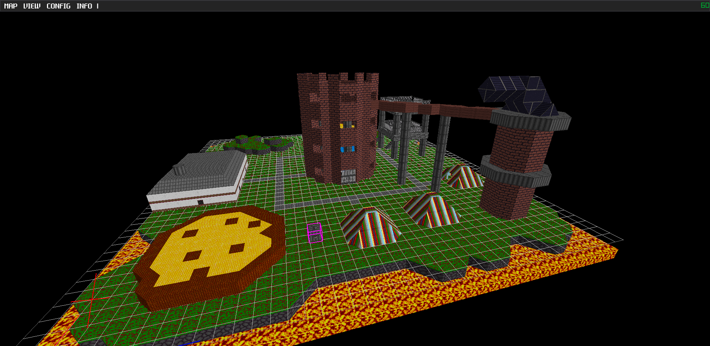

# TOTAL EDITOR 3

This is a 3D tile based map editor, succeeding the Total Editor 2 included with my game Total Invasion II.

It features an interface for laying out 3D shapes in a grid, assigning textures to each one, and adding
entities with arbitrary properties.

This is mainly for my own use, though I have included instructions and have tried to make it somewhat user friendly.
I don't know if I'll add many more features to it, unless people are actually using it for stuff.

As for the code, it is written in C++17, though I started it in C and that shows in certain places.
For libraries, I used [Raylib](https://github.com/raysan5/raylib) for rendering, [CPPCodec](https://github.com/tplgy/cppcodec) for base64 conversion, [Nlohmann's JSON lib](https://github.com/nlohmann/json) for JSON'ing, and [Dear ImGui](https://github.com/ocornut/imgui) for GUI'ing.

Credit for the editor font goes to [Humble Fonts Gold II](https://somepx.itch.io/humble-fonts-gold-ii) made by Eevie Somepx.

## Building

I use SCONS as a build system.
Make sure you have a RayLIB 4.5 library file (libraylib.a) in libraries/lib and run:

> scons
> 
And for debug mode,

> scons debug=1
> 
The SConstruct script should detect your operating system and run the appropriate tool for Windows and Linux.
It assumes that the Windows user is using TDM-GCC64 toolchain (mingw-w64 compiler) for now. 
Visual C++ users will have to change the command used in the SConstruct script (And will probably have to deal with some obscure compiler inconsistencies 9_9).
